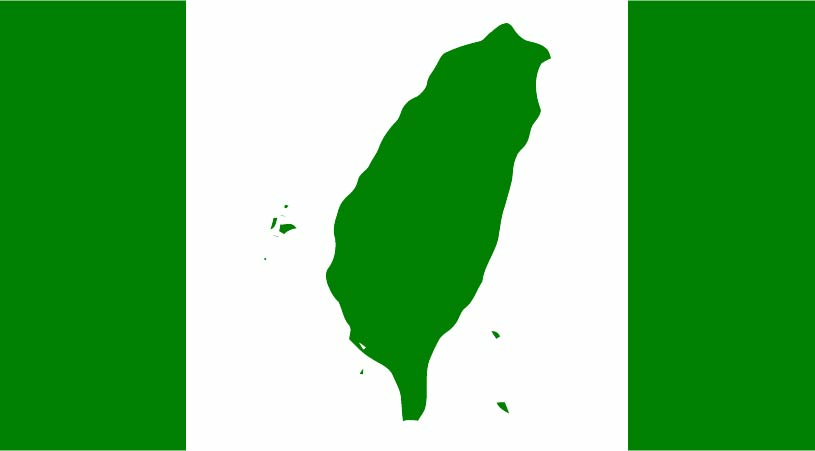

# 台灣共和國憲法草案

此處整理台灣共和國憲法草案之相關版本，促進台獨理念之討論。若有其他版本未收錄，敬請來信告知。

有關台灣獨立建國運動，請見[維基百科條目](https://zh.wikipedia.org/zh-tw/%E5%8F%B0%E7%81%A3%E7%8D%A8%E7%AB%8B%E9%81%8B%E5%8B%95)。

## 台灣共和國憲法草案各版本

* [台灣共和國憲法草案（第二次台灣人民制憲會議）](台灣共和國憲法草案（第二次台灣人民制憲會議）.md)
* [台灣憲法草案（人民制憲會議）](台灣憲法草案（人民制憲會議）.md)
* [台灣共和國憲法草案（許世楷）](台灣共和國憲法草案（許世楷）.md)
* [台灣共和國憲法草案（黃昭堂）](台灣共和國憲法草案（黃昭堂）.md)
* [台灣憲法草案（黃昭堂）](台灣憲法草案（黃昭堂）.md)
* [台灣民主共和國憲法草案（李憲榮）](台灣民主共和國憲法草案（李憲榮）.md)
* [台灣共和國基本法草案（林義雄）](台灣共和國基本法草案（林義雄）.md)
* [台灣共和國憲法草案（民主進步黨新潮流）](台灣共和國憲法草案（民主進步黨新潮流）.md)
* [民主大憲章（民主進步黨）](民主大憲章（民主進步黨）.md)
